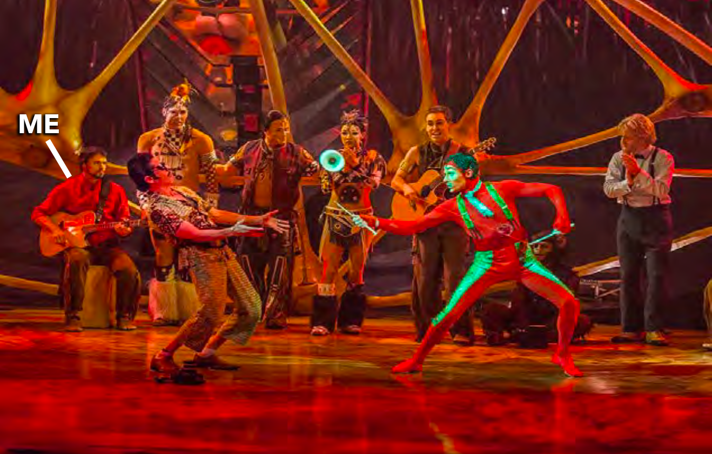

# Hi, I'm Josh.

<h3>I'm a front-end developer focused on building clean, modern web and mobile applications. I bring a creative, user-centered approach to everything I build — from product design to performance optimization.</h3>

### Tech Stack

-   **Languages**: TypeScript, JavaScript, HTML5, CSS3
-   **Frameworks**: React, Next.js, Angular, React Native, Expo
-   **Styling**: CSS, SCSS, Tailwind CSS
-   **Tools**: Firebase, Git, Webpack, Vite
-   **Specialties**: Accessibility, Responsive UI, Cross-platform development, Web audio applications

### Currently

<ul>
<li>Building <strong>Arcanae</strong> – a streaming audio soundscape app using React Native, Expo, and Firebase</li>
<li>Open to freelance and full-time roles in front-end or full-stack development</li>
<li>Adjusting to the matrix after extended travels to Asia</li>
<li>Perfecting my grandma's apple pie recipe</li>
</ul>

### Fun Fact

Before tech, I toured internationally for nearly a decade as bandleader and musician with Cirque du Soleil's TOTEM. I played over 2600 shows in 45 cities around the world.

Being a musician has taught me discipline, adaptability, leadership, how to work as a team, group dynamics, creative thinking, how to perform under pressure, and the power of focus and flow states. These traits and abilities feed back into my work as a developer. I thrive in collaborative, cross-functional teams and believe strongly that people do their best work when they're having fun.

Want to hear more? <a href="https://open.spotify.com/album/1uI4uLko57jaYCv9rOgm62">Here's one of my albums of Spotify.</a>

### Let's Connect

[LinkedIn](https://www.linkedin.com/in/joshuageisler/)
